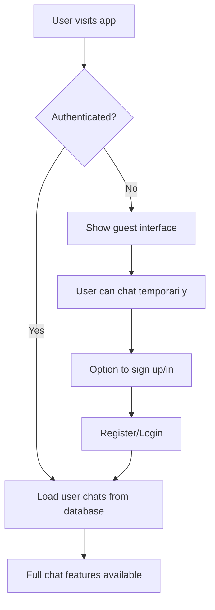

# Kanoon Sathi Frontend

A Next.js frontend application for the Kanoon Sathi legal AI assistant with comprehensive authentication and chat management.

## Features

### Authentication System
- **User Registration**: Create new accounts with username, password, and optional email
- **User Login**: Secure JWT-based authentication
- **Profile Management**: Update username and email, view account details
- **Guest Mode**: Use the app without registration (with limited features)
- **Persistent Sessions**: User sessions persist across browser restarts

### Chat System
- **Authenticated Users**:
  - Chat history is saved to the database
  - Access all previous conversations
  - Create, rename, and delete chats
  - Messages are synchronized across devices

- **Guest Users**:
  - Temporary chat sessions using GenKit Flow API
  - Local conversation management
  - Can upgrade to authenticated user to save history

### User Interface
- **Responsive Design**: Works on desktop and mobile devices
- **Dark Theme**: Modern dark UI optimized for extended use
- **Real-time Chat**: Instant message exchange with AI assistant
- **Conversation Management**: Easy navigation between different chat sessions

## API Integration

The application integrates with two API systems:

1. **REST API** (`http://localhost:3001`): User management and authenticated chat operations
2. **GenKit Flow API** (`http://localhost:7777`): AI responses and guest chat functionality

## File Structure

```
app/
├── page.tsx              # Main chat interface
├── login/page.tsx        # User login page
├── register/page.tsx     # User registration page
├── profile/page.tsx      # User profile/settings page
└── layout.tsx            # Root layout with AuthProvider

contexts/
└── auth-context.tsx      # Authentication state management

lib/
├── chat-api.ts          # API service for chat operations
└── utils.ts             # Utility functions

components/
├── chat/                # Chat-related components
│   ├── chat-area.tsx
│   ├── chat-input.tsx
│   ├── chat-message.tsx
│   ├── chat-sidebar.tsx
│   └── conversation-list.tsx
└── ui/                  # Reusable UI components
    ├── button.tsx
    ├── input.tsx
    ├── card.tsx
    └── ...

types/
└── chat.ts              # TypeScript type definitions
```

## Getting Started

1. **Install Dependencies**:
   ```bash
   npm install
   ```

2. **Environment Setup**:
   Make sure both backend services are running:
   - REST API on `http://localhost:3001`
   - GenKit Flow API on `http://localhost:7777`

3. **Run Development Server**:
   ```bash
   npm run dev
   ```

4. **Access the Application**:
   Open [http://localhost:3000](http://localhost:3000) in your browser

## Usage

### For New Users
1. Visit the homepage
2. Click "Sign Up" in the sidebar
3. Create an account with username and password
4. Start chatting with the AI assistant

### For Existing Users
1. Click "Sign In" in the sidebar
2. Enter your credentials
3. Access your saved chat history

### Guest Mode
1. Simply start typing in the chat interface
2. Your conversation will be temporary
3. Sign up anytime to save your chat history

## Authentication Flow



## API Endpoints Used

### Authentication (REST API)
- `POST /api/auth/register` - User registration
- `POST /api/auth/login` - User login
- `GET /api/auth/me` - Get current user
- `PUT /api/auth/profile` - Update user profile

### Chat Management (REST API - Authenticated)
- `GET /api/chats` - Get user's chats
- `POST /api/chats` - Create new chat
- `GET /api/chats/:id` - Get chat with messages
- `PUT /api/chats/:id` - Update chat title
- `DELETE /api/chats/:id` - Delete chat
- `POST /api/chats/:id/messages` - Add message to chat

### AI Interaction (GenKit Flow API)
- `POST /autonomousAIFlow` - Send message to AI
- `GET /getChatHistory` - Get chat history (guests)
- `GET /getConversationList` - Get conversation list (guests)

## Key Components

### AuthContext
Manages global authentication state including:
- User information
- JWT token
- Login/logout functions
- Profile updates

### ChatApiService
Handles all API calls for:
- Chat CRUD operations
- Message management
- AI interactions
- Guest chat functions

### Chat Components
- **ChatSidebar**: Navigation and user controls
- **ChatArea**: Message display with markdown support
- **ChatInput**: Message composition
- **ConversationList**: Chat history navigation

## Security Features

- JWT token-based authentication
- Secure password handling
- Input validation on both client and server
- Protected routes for authenticated features
- Automatic token refresh handling

## Contributing

1. Fork the repository
2. Create a feature branch
3. Make your changes
4. Test thoroughly
5. Submit a pull request

## License

This project is licensed under the MIT License.
